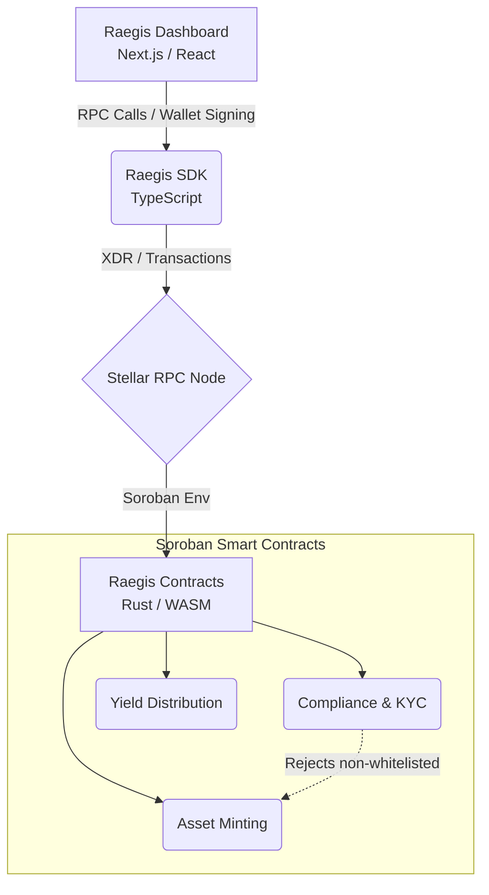

#  Raegis RWA Protocol

**Bridging real-world value with decentralized liquidity through compliant, institutional-grade tokenization on the Stellar network.**

Welcome to the official GitHub organization for **Raegis RWA**. We are building the infrastructure required to compliantly tokenize Real-World Assets (RWAs)—such as fractional real estate, treasury bills, and private credit—bringing transparent, composable, and programmable liquidity to traditional finance.

##  Ecosystem Overview

The Raegis RWA Protocol is composed of three foundational pillars, designed for maximum composability and developer experience.

*  **[`Raegis-contracts`](https://github.com/Raegis-RWA/Raegis-contracts)**: The core Soroban smart contracts written in Rust. Handles asset minting, KYC/whitelist compliance enforcement, and yield distribution.
*  **[`Raegis-sdk`](https://github.com/Raegis-RWA/Raegis-sdk)**: The official TypeScript middleware. Abstracts complex Stellar RPC interactions and XDR parsing, allowing developers to integrate Raegis RWA into any Node.js or browser environment seamlessly.
*  **[`Raegis-dashboard`](https://github.com/Raegis-RWA/Raegis-dashboard)**: The Next.js frontend reference implementation. Provides an institutional-grade interface for Administrators (minting/compliance) and Investors (portfolio tracking/transfers).

##  System Architecture

Our protocol enforces strict separation of concerns, ensuring compliance at the base layer while maximizing flexibility at the application layer.

## Protocol Roadmap

* Phase 1: Testnet MVP (Current) 
  * Deploy core Soroban contracts to Stellar Testnet.
  * Publish Alpha version of @Raegis/sdk.
  * Release v1 of the Raegis Dashboard for community testing.
* Phase 2: Security & Audits
  * Comprehensive test coverage and formal verification. 
  * Third-party smart contract security audits. 
  * Integration with Stellar Ecosystem compliance oracles.
* Phase 3: Mainnet Launch
  * Deploy contracts to Stellar Public Network. 
  * Onboard initial institutional asset issuers. 
  * Launch developer grant program for SDK integrators.

## Getting Started
We welcome contributions from the global Web3 community! Whether you are a Rust veteran optimizing our Soroban logic, or a frontend engineer refining our dashboard, there is a place for you here.

1. Read our Contributing Guidelines to understand our workflow. 
2. Review our Code of Conduct. 
3. Check the Good First Issue labels on any of our repositories. 
4. Join the discussion in the Stellar Developer Discord.

Security Note: If you find a vulnerability, please DO NOT open a public issue. See our Security Policy for responsible disclosure.
